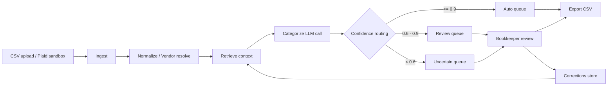

# LedgerLens — Architecture

> **Status:** Specification (pre-implementation). This document describes the system as it is intended to be built, not as it currently exists. Sections will be revised to descriptive voice as components ship.
>
> **Last updated:** 2026-05-21
> **Maintainer:** Michael Palmer

---

## 1. System purpose

LedgerLens categorizes bank and credit-card transactions against a per-business chart of accounts. For each transaction it produces a categorization decision, a calibrated confidence score, and a short reasoning trace. Low-confidence and ambiguous decisions are routed to a human review queue; corrections feed back into the system as retrieval signal for future categorizations.

LedgerLens is **not** a general ledger, a tax-filing tool, a payroll system, or a production Plaid integration. It is a focused assistive tool for bookkeepers and the firms that employ them.

The primary user is a bookkeeper categorizing transactions. The primary buyer is a fractional-CFO firm or bookkeeping practice owner managing a roster of small-business clients.

## 2. Architectural drivers

The following non-functional requirements shaped the design. Every significant decision in this document can be traced back to one of them.

- **Accuracy with calibration.** Headline accuracy is necessary but not sufficient. The system's confidence score must correlate with actual correctness so that the review-queue threshold is meaningful. A miscategorized transaction with 95% claimed confidence is worse than one with 60% — the former silently corrupts the books, the latter routes itself to a human.
- **Auditability.** Every categorization decision must be explainable after the fact. Reasoning, retrieved context, and the model version used are persisted alongside the decision. This is a tax-defense requirement, not a nice-to-have.
- **Cost per transaction.** Bookkeepers serve many clients on thin margins. A categorizer that costs $0.01 per transaction is viable; one that costs $0.10 is not. The fallback chain (cheap-model-first, expensive-model-on-uncertainty) is a direct response to this constraint.
- **Learnability from corrections.** The system must improve from human corrections without requiring fine-tuning or model retraining. Corrections are stored as structured data and retrieved as in-context examples for similar future transactions.
- **Honest failure modes.** When the system is uncertain, it must surface that uncertainty rather than guess. The review queue is the primary mechanism for this; the confidence threshold is the primary control surface.

## 3. High-level structure

| Component | Responsibility | Technology |
|---|---|---|
| Ingest | Accept transactions from CSV upload or Plaid sandbox webhook; deduplicate on (business_id, date, amount, raw_description). | FastAPI endpoint, Postgres |
| Normalize | Clean raw transaction descriptions; resolve to a canonical vendor where possible via fuzzy match. | Python, RapidFuzz |
| Retrieve | For each transaction, assemble the prompt context: the business's chart of accounts, top-K similar prior categorizations, vendor-specific corrections. | Postgres + pgvector for embedding similarity |
| Categorize | Single structured-output LLM call returning category, confidence, reasoning, and an alternative category. | Anthropic API (Haiku primary, Sonnet fallback) |
| Route | Place each categorized transaction into one of three queues based on confidence threshold. | Application logic |
| Review UI | Bookkeeper workflow for accepting, correcting, or recategorizing suggestions. Keyboard-driven. | Next.js 14, React |
| Corrections store | Persist every human override as a structured record for retrieval in future categorizations. | Postgres |
| Eval harness | Run the categorizer against labeled test sets; gate prompt changes on regression. | Python, pytest |

## 4. The categorization pipeline

The pipeline is the core of the system. Each stage has an explicit contract; the boundaries between stages are the system's most important invariants.

**Stage 1 — Ingest.** Input: a CSV file or a Plaid sandbox webhook payload. Output: zero or more `transactions` rows in `status='pending'`. Idempotent on `(business_id, date, amount, raw_description, source_id)`. Duplicate ingestion is a no-op, not an error — bookkeepers will re-upload the same file.

**Stage 2 — Normalize and vendor-resolve.** Input: a `pending` transaction. Output: the same transaction with a cleaned description and, where confidence permits, a resolved `vendor_id`. Vendor resolution is fuzzy-match against the `vendors` table for this business, with a configurable similarity threshold. A failed resolution is fine — the transaction proceeds without a vendor and the LLM handles it from the raw description.

**Stage 3 — Retrieve.** Input: a normalized transaction. Output: a structured context object containing the chart of accounts, top-K (default K=5) similar prior categorized transactions for this business, and any vendor-specific corrections. Similarity is computed as a weighted combination of vendor match (heavy weight) and embedding similarity on the description (lighter weight). This is RAG used for personalization from a high-signal small corpus, not for document Q&A.

**Stage 4 — Categorize.** Input: the normalized transaction plus the retrieved context. Output: a structured-output decision conforming to a Pydantic schema (`category_id`, `confidence: float ∈ [0, 1]`, `reasoning: str`, `alternative_category_id: Optional[int]`). Uses the fallback chain: Haiku for the first pass; if confidence < 0.7 or the transaction triggers an "ambiguity heuristic" (large amount, first-time vendor, first-time category for this business), retry with Sonnet. Both calls are logged with full prompt, response, model version, latency, and token counts.

**Stage 5 — Route.** Input: a categorization decision. Output: the transaction is placed in `auto`, `review`, or `uncertain` queue per the thresholds in section 2. The thresholds are configurable per business once enough data exists to calibrate them.

**Stage 6 — Learn.** Input: a human correction (accept, override, or recategorize). Output: a row in the `corrections` table. If a vendor's corrections show a clear consensus (e.g., the same override applied N times), the vendor's `default_category_id` is updated. This is the only path by which the system's behavior changes between deployments — there is no model fine-tuning loop.

The contract that matters most: **no stage may write to the corrections table except the Learn stage, and no stage may read from it except the Retrieve stage.** This boundary is what makes the learning loop debuggable.

## 5. Data model

Six core entities. Each has a clear domain meaning before any database concerns enter the picture.

- **`businesses`** — a single small-business client. Carries the industry tag used for prompt selection and an optional Plaid item ID for sandbox testing.
- **`chart_of_accounts`** — per-business accounts with a code, name, and **description**. The description is critical because it is what the LLM reads to understand what each account means in this specific business's context. A generic "Office Supplies" account in an auto-repair shop means something different than in a design agency.
- **`vendors`** — per-business records mapping a raw transaction description pattern to a canonical vendor name and an optional default category. Populated lazily as transactions are ingested and resolved.
- **`transactions`** — the central table. Carries both the suggestion (category, confidence, reasoning) and the final state (category, reviewed_by, reviewed_at). Keeping suggestion and final state in the same row is a deliberate choice: it makes the audit trail trivial and the eval queries simple. The cost is one wider row; the alternative — a separate decisions table — adds a join to every common query.
- **`corrections`** — the learning substrate. Every human override produces a row here, even when the override is "accept as-is" (which is itself signal — it confirms the suggestion was correct). Kept separate from the transactions table because corrections are append-only and queried as a corpus; transactions are mutable and queried by ID.
- **`eval_runs`** — one row per eval harness execution, with the prompt version, model, timestamp, and a JSON blob of per-category metrics. Versioning evals alongside prompts is what makes prompt iteration safe.

A note on why `corrections` is not just a column on `transactions`: corrections have their own lifecycle. The same transaction might be corrected, then re-corrected after a chart-of-accounts restructuring. The history matters for both the learning loop and for audit. Collapsing history into the current state is a one-way operation and a class of bug that has bitten enough financial-data systems to be worth designing against.

## 6. Retrieval strategy

Retrieval is where most LLM applications quietly fail. For LedgerLens the retrieval design is deliberately narrow.

**What is retrieved for each categorization call:**

1. The complete chart of accounts for this business. Always — never partial. The LLM must see all categories to choose among them, and charts of accounts are small enough (typically 30-80 accounts) that there is no budget reason to truncate.
2. Up to K=5 similar prior categorized transactions from this same business. Similarity is computed as: exact vendor match scores 1.0; otherwise, embedding cosine similarity on the cleaned description, with a minimum threshold of 0.7 to include.
3. The corrections history for this vendor, if any. A vendor that has been corrected three times to "Repairs & Maintenance" should bias the next decision toward that category, with the reasoning trace acknowledging the prior corrections.

**Embedding model:** a small, cheap embedding model is sufficient. The signal in a transaction description is dense; large-context embedding models are overkill.

**Cold-start handling.** A brand-new business has no correction history and no prior categorized transactions. In this case retrieval returns only the chart of accounts, and the prompt explicitly notes the absence of historical context. The confidence calibration must reflect this — early predictions for a new business will be lower-confidence by default, routing more transactions to human review until the system has seen enough corrections to bias future decisions. This is a feature, not a bug; bookkeepers expect to do more work in the first month of a new client engagement.

**What is deliberately not retrieved.** Cross-business signal. Even though pooling corrections across businesses would improve cold-start performance, it introduces privacy and contamination risks (one business's idiosyncratic categorization scheme leaking into another's). The portfolio version of the system keeps the retrieval boundary at the business level; cross-business signal is noted in section 11 as a deferred decision.

## 7. Evaluation as a system component

The eval harness is treated as a first-class part of the architecture, not a testing afterthought.

**Location:** `evals/` directory in the repo. Test sets are versioned JSON files; runs are timestamped JSON outputs.

**Test set composition:** three synthetic businesses (coffee shop, freelance design agency, auto repair shop) with ~100 hand-labeled transactions each. Held-out: ~100 transactions across the three businesses, never used during prompt development. Adversarial slice: ~30 transactions where two competent labelers would plausibly disagree, scored separately.

**Metrics reported per run:**
- Overall accuracy.
- Per-category precision and recall.
- Calibration: a reliability diagram comparing predicted confidence buckets to actual accuracy in each bucket.
- Cost per 100 transactions (USD).
- p50 and p95 latency per transaction.

**Gating rule:** no prompt change merges to main without an eval run on the dev set showing no regression beyond a configurable tolerance on overall accuracy *or* calibration *or* cost. The held-out set is run only at release boundaries to detect dev-set overfitting.

**LLM-as-judge for reasoning quality:** a separate Claude call grades the reasoning trace of each categorization against a rubric (Does the reasoning reference the actual retrieved context? Does it acknowledge ambiguity where present? Does it justify the chosen category over the alternative?). The judge is itself validated against 30 hand-graded examples; if judge-human agreement drops below 85%, the rubric is revised before the judge is trusted.

## 8. State, idempotency, and reprocessing

**Ingest is idempotent** on the deduplication key. Re-uploading the same CSV produces no new rows.

**Categorization is not idempotent by default.** Re-running the categorizer on the same transaction may produce a different decision because the retrieved context changes as the corrections table grows. This is correct behavior for the learning loop but means re-categorization must be an explicit, logged action — not a side effect of, e.g., a webhook retry. A `reprocessed_from` column on transactions tracks lineage when a transaction is re-categorized.

**Malformed model responses** are caught at the Pydantic validation boundary. A failed parse triggers one retry with a stricter prompt suffix instructing the model to conform to the schema. A second failure routes the transaction to the uncertain queue with a synthetic "model produced malformed output" reasoning trace. The transaction is never silently dropped.

**Corrections are append-only.** A bookkeeper who changes their mind produces a new correction row, not a modification of the old one. The most recent correction wins for retrieval purposes; the history is preserved for audit.

## 9. Observability

Every LLM call is logged with: prompt version, model, full prompt, full response, latency, input/output token counts, cost estimate, and the IDs of the retrieved context items. This log is the system's single most valuable artifact — it is what makes prompt iteration possible, what makes cost optimization possible, and what makes the eval harness's claims verifiable.

Metrics exposed (Prometheus-compatible): categorization latency histogram, confidence distribution histogram, cost-per-transaction gauge, queue depths, correction rate (corrections per categorization).

Traces (OpenTelemetry): a single trace per ingested transaction spans ingest through categorization through routing. The Retrieve and Categorize stages are separate spans so retrieval cost can be measured independently of model cost.

## 10. Security and data handling

Financial transaction data is sensitive even when it doesn't contain account numbers. The system treats raw transaction descriptions as PII-adjacent and applies the following:

- LLM provider calls are routed to a US-region endpoint. No data residency claims are made beyond what the provider's terms guarantee.
- Prompts and responses are logged in the application database, not sent to a third-party logging service.
- A redaction pass strips obvious PII patterns (SSN-shaped strings, full credit-card numbers) from transaction descriptions before they enter the prompt. This is defense-in-depth; well-formed bank exports should not contain such data, but malformed CSVs sometimes do.
- The portfolio version uses single-organization-per-deployment auth. Multi-tenant isolation is a deferred decision documented in section 11.
- Database encryption-at-rest relies on the hosting provider's default (Railway Postgres). This is honest about the portfolio scope; production deployment for a real customer would require an explicit encryption-at-rest review.

## 11. Known limitations and deferred decisions

The following are intentional scope limits for the portfolio version. Each is a v1 problem, not a v0 problem.

- **Plaid integration is sandbox-only.** Production Plaid requires business verification and ongoing compliance overhead that adds nothing to the AI-engineering story.
- **QuickBooks integration is read-only CSV export.** Bi-directional sync requires OAuth handling and write-side conflict resolution that is multi-week work.
- **Multi-tenant auth is single-org-per-deployment.** A real SaaS deployment would require row-level security, per-tenant data isolation, and an audit trail keyed to user identity. None of this is conceptually hard; all of it is time-consuming.
- **Vendor resolution uses fuzzy matching, not entity resolution.** Transaction descriptions with embedded transaction IDs ("AMZN MKTP US*RT4G9JK22") are resolved correctly only when a similar prior pattern exists. A proper entity-resolution layer is v1 work.
- **Cross-business signal is not used.** Pooling corrections across businesses would help cold-start performance but raises privacy and contamination concerns deferred to v1.
- **No mobile UI.** The review queue is desktop-only. Bookkeepers work at desks; this is an acceptable scope choice for the portfolio version.

## 12. What would change at scale

At 10x the portfolio's design load:

- The synchronous categorization endpoint becomes a queue. Ingest writes to a work queue; categorization workers consume from it; the UI polls or subscribes for results. This is a straightforward refactor but not worth doing at portfolio scale where synchronous is simpler to demo and debug.
- Per-business retrieval indexes need to be sharded or partitioned. pgvector handles thousands of vectors per business comfortably; at hundreds of thousands per business the index strategy needs revisiting.
- LLM cost dominates the total system cost. A fine-tuned smaller open-weight model on the routine 85% of transactions, with Claude reserved for the ambiguous 15%, becomes economically meaningful.
- The eval harness needs to run continuously against production traffic (with appropriate sampling and privacy controls) to detect drift, not just at prompt-change time.

None of this is on the portfolio roadmap. Acknowledging the trajectory is sufficient.

## 13. ADR index

Architecture Decision Records live in `docs/adr/`. The following ADRs are planned for v0:

- **ADR-001** — Choice of Anthropic API over multi-provider abstraction.
- **ADR-002** — Synchronous categorization endpoint over queue-based processing for v0.
- **ADR-003** — pgvector over a dedicated vector store.
- **ADR-004** — Separate `corrections` table over an updates column on `transactions`.
- **ADR-005** — Haiku-primary, Sonnet-fallback model selection over single-model.
- **ADR-006** — Synthetic eval businesses over real anonymized data.

Each ADR follows the standard format: context, decision, consequences, alternatives considered.
